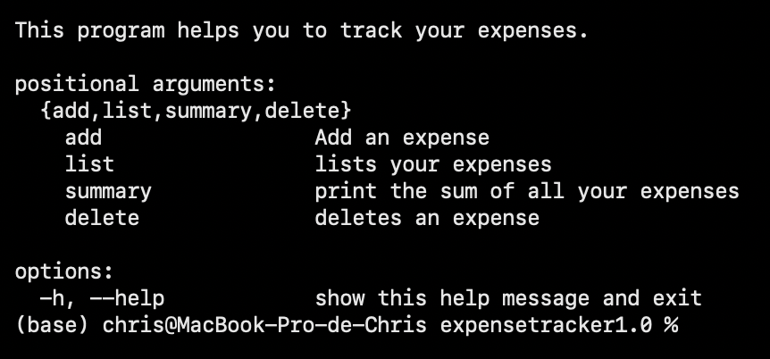

# EXPENSE TRACKER CLI
## Description
ExpenseTrackerCLI is a command line interface program made to help you track your daily expenses.
It allows you to store, list, and summarize all your expenses.
## Installation

Clone the repository 
```shell
git clone https://github.com/Chr1s2564/Expense-Tracker.git
cd expense-tracker-cli
```

Create a Virtual Environment
```shell
python -m venv env

# On Windows:
.\env\Scripts\activate

# On macOS and Linux:
source env/bin/activate
```

Install dependencies
```shell
pip install -r requirements.txt
```

## Using Expense Tracker CLI
ExpenseTrackerCLI is command based.
```shell
python expensetracker.py
```
This will print the help menu for the program showing every feature.



## Features

 - [x] Add an expense 
    ```shell
    python expensetracker.py add --description <DESCRIPTION> --amount <AMOUNT>
    ```
 - [x] List all expenses (can be done by month too but optional)
    ```shell
    python expensetracker.py list --month <MONTH>
    ```
 - [x] Summarize your expense (can be done by month too but optional)
    ```shell
    python expensetracker.py list summary --month <MONTH>
    ```
 - [x] Delete an expense
   ```shell
    python expensetracker.py delete --id <ID>
    ```
   
## Project Source 

I took this project idea from [Roadmap.sh](https://roadmap.sh/projects/expense-tracker)

## Back Story

I am a young guy learning to code. This is my second project from [roadmap.sh/projects](https://roadmap.sh/projects) to train and push myself to discover new things.
